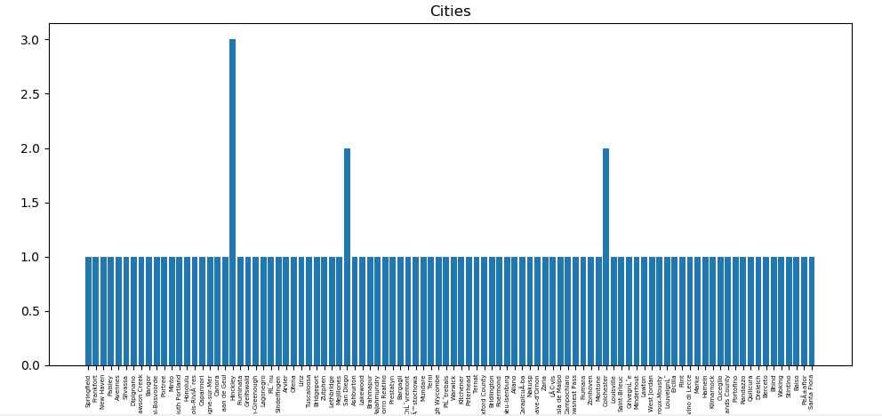

ASE PROJECT

As a micro-project we had to do excercise nr. 2 with a data set: dataMay-31-2017.json (C). Our goal was to count the 
ammount of people with the same name, company and city where they work. Last point was to plot all collectd data.

We created 2 main scripts: pypsparkSrc.py and plotter.py.
 - plotter.py 
 
    By executing this script we were able to show 3 plots. Each one was telling us the amount of people:
    a) with the same name
    b) who works in the same city
    c) who works in the same company
    
    As we an see the script is easy to understand and the plotted data is obtained from json file attached to this repo.
    
 - pysparkSrc.py
 
    This is the hearth of whole 'project', where becomes communication with our database.
    
    We had to start work by creating S3 bucket and uploading our data out there. To do it easily, we created simple
    function that converts .json file into .txt file with the same data inside but formatted differenty (convert_data).
    From now collected data was stored in preparedData.txt and each line of this file could be compared with a record of 
    a database table with following headings: Company, City, Name. (We had to do it manually)
    
    With data prepared like this we could go forward and create SparkContext and SQLContext class instances. Using
    spark_ctx we were able to read txt file as Resilient Distributed Dataset from our bucket. To do it we used textFile 
    and map method. 
    
    Later, we created dataframe from RDD and 'headings' struct wchich contains headings of our data. Like an RDD, 
    a DataFrame is an immutable distributed collection of data. Unlike an RDD, data is organized into named columns.
    After that we collect results equal to querry we created: 
    
    'SELECT company, city, name, COUNT(*) FROM project_data GROUP BY company, city, name HAVING COUNT(*)>0'
    
    Results were saved in: 's3://projektase/results' (.csv file)
    
    That's what contains pysparkSrc.py file. After creating cluster we connected to it using putty, uploaded our code 
    and executed it. The only thing that left was downloading our results.csv file. It is also attached to repository.
	
	
Below we can see plot created by plotter.py script: 

    
 
    
    
    
    
    
     

